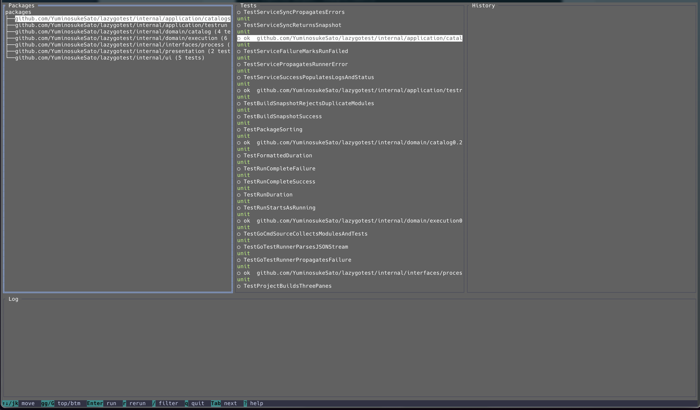

# lazygotest

A beautiful terminal UI for running Go tests interactively, inspired by lazygit.


## Overview

`lazygotest` brings the joy of lazygit's user experience to Go testing. Navigate your test suites with vim-style keybindings, see real-time results with beautiful color-coded output, and enjoy an accessible interface designed with universal design principles.

## Features

- **lazygit-inspired color scheme** - Soothing Catppuccin Mocha theme with WCAG-compliant contrast
- **Smart directory detection** - Automatically finds `go.mod` by walking up parent directories
- **Interactive test runner** - Browse packages and tests with intuitive vim-style navigation
- **Real-time feedback** - Watch test results and logs stream in as they happen
- **Universal design** - Fully accessible with color-blind friendly icons and clear focus indicators
- **Terminal compatibility** - Works seamlessly with iTerm2, Warp, Alacritty, kitty, and more

## Installation

### Via go install (Recommended)

```bash
go install -tags tview github.com/YuminosukeSato/lazygotest/cmd/lazygotest@latest
```

### From Source

```bash
git clone https://github.com/YuminosukeSato/lazygotest.git
cd lazygotest
make install
```

## Requirements

- Go 1.25 or higher
- Interactive terminal with TTY support
- Unix-like environment (macOS, Linux, WSL)

## Docker Usage

### Using Docker

```bash
# Build the Docker image
docker build -t lazygotest .

# Run with Docker (interactive TTY required)
docker run -it --rm -v $(pwd):/workspace -w /workspace lazygotest
```

### Using Docker Compose

```bash
# Build and run with docker-compose
docker-compose run --rm lazygotest

# Or run in a specific directory
docker-compose run --rm lazygotest /path/to/project
```

**Note:** Docker usage requires mounting your Go project directory as a volume to analyze and run tests.

## Quick Start

```bash
# Run in current directory (auto-detects go.mod)
lazygotest

# Run in specific directory
lazygotest .
lazygotest /path/to/your/project
```

## Usage

### TUI Interface



The TUI provides a comprehensive 4-pane layout for efficient test navigation and execution:

- **Packages pane** (left) - Browse all test packages in your project with folder hierarchy
- **Tests pane** (top right) - View individual test functions in the selected package
- **History pane** (middle right) - Track recent test executions with real-time status updates
- **Log pane** (bottom) - Monitor detailed test output, stack traces, and error messages

The bottom status bar displays context-sensitive keyboard shortcuts for quick reference.

### Basic Workflow

1. **Navigate packages** - Use `↑↓` or `j/k` to browse the Packages pane
2. **Select a package** - Press `Enter` or move to Tests pane with `Tab` or `→`
3. **Choose a test** - Navigate the Tests pane to find your target test
4. **Run test** - Press `Enter` to execute (watch results in History and Log panes)
5. **Review output** - Check the Log pane for detailed execution information
6. **Rerun if needed** - Press `r` to quickly rerun the last test

### Status Indicators

Each test displays a visual status icon for quick identification:

- `○` **Pending** - Test has not been run yet
- `⏳` **Running** - Test is currently executing
- `✓` **Pass** - Test completed successfully (green)
- `✗` **Fail** - Test failed with errors (red)

The currently focused pane is highlighted with a bright blue border for clear visual feedback.

## Keyboard Shortcuts

### Navigation
- `↑↓` or `j/k` - Move up/down in current pane
- `←→` or `h/l` - Switch between panes
- `gg` / `G` - Jump to top/bottom
- `Tab` / `Shift-Tab` - Cycle focus between panes

### Actions
- `Enter` - Run selected test or package
- `r` - Rerun last test
- `/` - Open filter dialog
- `?` - Show help
- `q` or `Esc` - Quit application

### Visual Feedback
- **Focused pane** - Bright blue border (RGB: 137, 180, 250)
- **Test status icons** - ✓ (pass), ✗ (fail), ⏳ (running), ○ (pending)
- **Status bar** - Context-sensitive key bindings at bottom

## Theme and Accessibility

### Catppuccin Mocha Color Palette

The color scheme is carefully chosen for both aesthetics and accessibility:

- **Background** - Deep navy (#1e1e2e) for reduced eye strain
- **Text** - Soft lavender (#cdd6f4) with 4.5:1+ contrast ratio
- **Success** - Mint green (#a6e3a1)
- **Failure** - Rose pink (#f38ba8)
- **Running** - Warm yellow (#f9e2af)
- **Focus border** - Sky blue (#89b4fa)

### Universal Design Features

- **WCAG 2.1 AA compliant** - All text meets minimum 4.5:1 contrast ratio
- **Icons + colors** - Status conveyed through both visual channels for color-blind users
- **Clear focus indicators** - Always know which pane is active
- **Multiple input methods** - Arrow keys and vim-style keybindings both supported
- **Titled panes** - Each section clearly labeled for screen readers

### Terminal Compatibility

| Terminal | Status |
|----------|--------|
| macOS Terminal.app | ✅ Supported |
| iTerm2 | ✅ Supported |
| Warp | ✅ Supported |
| Alacritty | ✅ Supported |
| kitty | ✅ Supported |
| tmux | ✅ Supported |
| CI/CD environments | ⚠️ Requires TTY |

## Development

### Building from Source

```bash
# Build binary to ./bin/lazygotest
make build

# Run all tests
make test

# Run tview-specific tests
make test-tview

# Run linter and formatter
make lint
make fmt

# Full check (format, lint, test, build)
make all
```

### Available Make Targets

```bash
make help        # Show all available targets
make build       # Build the binary
make test        # Run all tests
make test-tview  # Run tview-specific tests
make run         # Build and run the application
make install     # Install to $GOPATH/bin
make clean       # Remove build artifacts
make lint        # Run golangci-lint
make fmt         # Format code with gofmt
make all         # Full pipeline (default)
```

### Project Structure

```
lazygotest/
├── cmd/
│   ├── lazygotest/        # Main CLI entry point
│   └── main_tview.go      # TUI application with tview
├── internal/
│   ├── application/       # Application layer (use cases)
│   ├── domain/           # Domain layer (business logic)
│   ├── infrastructure/   # Infrastructure layer (external deps)
│   ├── interfaces/       # Interface adapters
│   ├── presentation/     # View models
│   └── ui/              # TUI components (tview adapters)
└── Makefile
```

## Contributing

Contributions are welcome! Please follow these guidelines:

### Development Workflow

1. **Fork and clone** the repository
2. **Create a feature branch**: `git checkout -b feat/your-feature`
3. **Follow TDD**: Write failing test → Implement → Refactor
4. **Keep PRs small**: Aim for ≤20 lines per PR when possible
5. **Run checks**: `make all` before committing
6. **Commit with semantic messages**:
   ```bash
   feat: add new feature
   fix: resolve bug
   docs: update documentation
   refactor: improve code structure
   test: add test coverage
   ```

### Code Style

- Follow standard Go conventions (`gofmt`, `golangci-lint`)
- Use build tag `//go:build tview` for TUI-specific code
- Add comments only for "why not" explanations
- Write self-documenting variable and function names

### Testing

- All new features must include tests
- Maintain or improve test coverage
- Use table-driven tests where appropriate
- Test file naming: `*_test.go`

## License

MIT License - see [LICENSE](LICENSE) file for details.

## Acknowledgments

- Inspired by [lazygit](https://github.com/jesseduffield/lazygit) by Jesse Duffield
- Built with [tview](https://github.com/rivo/tview) by Trevor Hilton
- Color scheme from [Catppuccin](https://github.com/catppuccin/catppuccin)

## Support

- **Issues**: [GitHub Issues](https://github.com/YuminosukeSato/lazygotest/issues)
- **Discussions**: [GitHub Discussions](https://github.com/YuminosukeSato/lazygotest/discussions)

---

Made with ❤️ for the Go community
